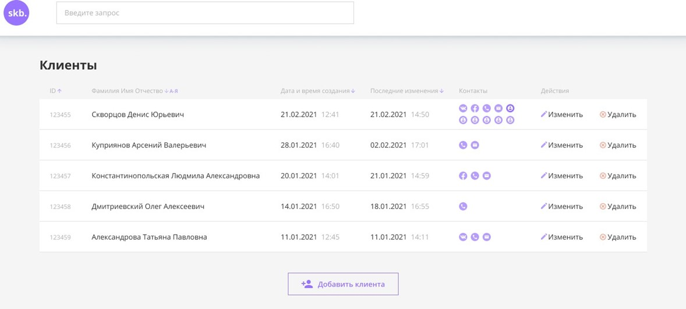
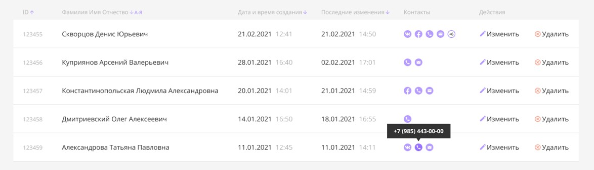
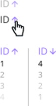
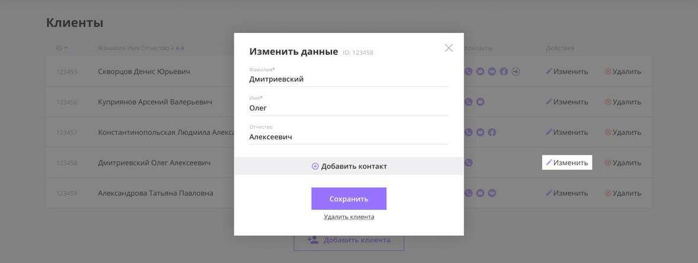
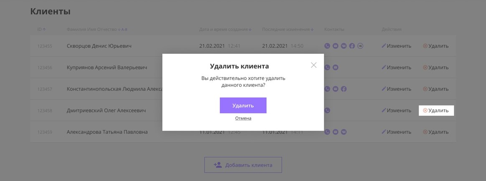
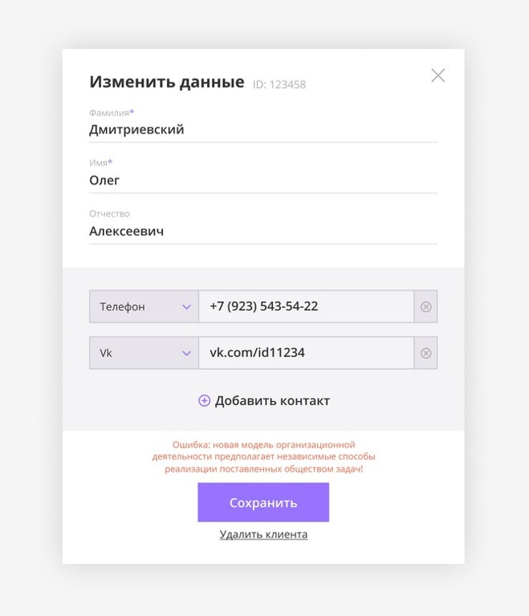

# The project is implemented using pure ```JavaScript```.

## Description project

The project is a web interface for a CRM system, which has the following features:

+ View a list of people in a table
+ Adding a new client
+ Changing information about an existing client
  
Each contact is the following set of data:
+ Name
+ Surname
+ Patronymic
+ Array of objects with contact data, where each object contains:
  + Contact type (phone, email, VK, etc.)
  + Contact value (phone number, email address, link to VK page, etc.)

The interface is a single page, which contains a table of clients, a button for adding a new client, as well as a header with the company logo and a client search bar.



## Description of application screens

### Table with a list of clients
**The table with a list of people has the following columns.**
+ ID
+ Full name (Surname, First name, Patronymic, separated by a space)
+ Date and time of creation
+ Date and time of last change
  + Contacts
  + Actions (buttons) Edit client Delete client
  



|  |  |
| -- | -- |
|  | Sorting All column headers except contacts and actions can be clicked to set sorting by he corresponding field. The first click sets sorting in ascending order, the second click sets sorting in descending order. Sorting must be done from JavaScript, i.e. the API passes the data unsorted. |

## Actions on clients
When you click the "Edit" button, a modal window with a client change form should appear. A detailed description of the form's behavior is given below.



When you click the "Delete" button, a modal window should appear confirming the action. If the user confirms the deletion, the person should be removed from the list. A deletion request should also be sent to the server with the API.



## Client Contacts
The contacts block provides the ability to add up to 10 contacts inclusive. To do this, there is a "Add contact" button under the added contacts. If the client has already added 10 contacts, the button is not displayed.

<table>
    <tr>
        <td>
            
        </td>
        <td>
        The contact type is selected from a drop-down list with one of the following values:
            <ul> 
              <li>Phone</li>
              <li>Email</li>
              <li>Facebook</li>
              <li>VK</li>
              <li>Other</li>
            </ul> 
        </td>
    </tr>
</table>

Each contact can be removed from the list by clicking on the cross to the right of it.

# Usage

To run the application, you must first run the backend server (the instructions for running the backend server are in the folder crm-backend > readme.md file). Then, using the live server, or install the ```npm serve```, then write the command ```serve -s .\crm-frontend\```
